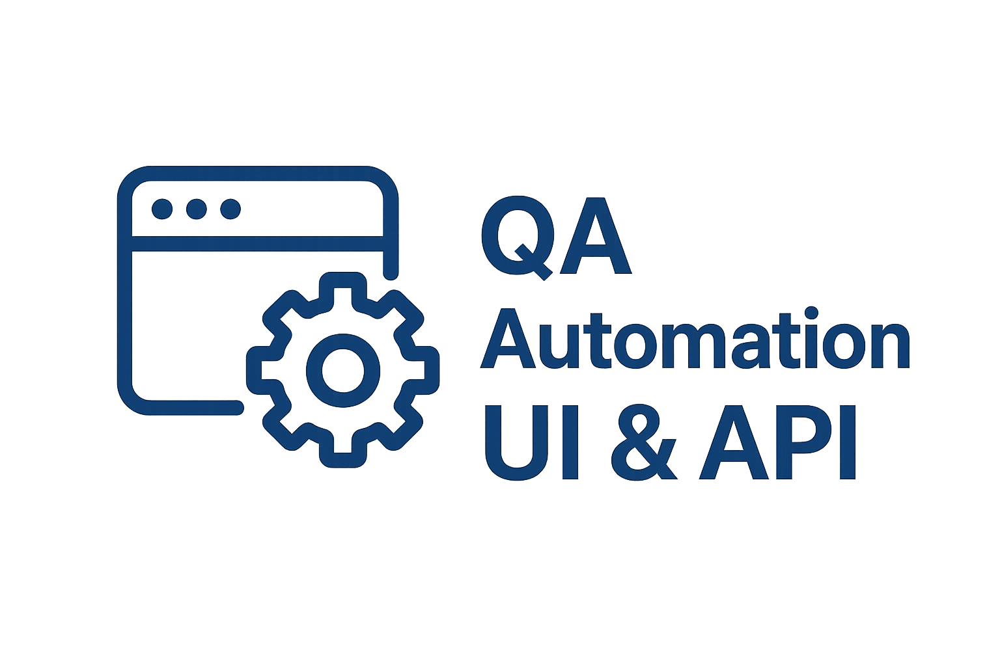

<a id="readme-top"></a>
<br />
<div align="center">
  <a href="https://github.com/PimenovYaroslav/qa_automation_ui_and_api">
    
  </a>

<h3 align="center">QA Automation: UI and API Testing</h3>
  <p align="center">
    A comprehensive and robust automation framework for testing both web UI and REST APIs, built with Python and Pytest.
    <br />
    <a href="https://github.com/PimenovYaroslav/qa_automation_ui_and_api"><strong>Explore the docs »</strong></a>
    <br />
    <br />
    <a href="https://github.com/PimenovYaroslav/qa_automation_ui_and_api">View Demo</a>
    &middot;
    <a href="https://github.com/PimenovYaroslav/qa_automation_ui_and_api/issues/new?labels=bug&template=bug-report---.md">Report Bug</a>
    &middot;
    <a href="https://github.com/PimenovYaroslav/qa_automation_ui_and_api/issues/new?labels=enhancement&template=feature-request---.md">Request Feature</a>
  </p>
</div>
<!-- TABLE OF CONTENTS -->
<details>
  <summary>Table of Contents</summary>
  <ol>
    <li>
      <a href="#about-the-project">About The Project</a>
      <ul>
        <li><a href="#built-with">Built With</a></li>
      </ul>
    </li>
    <li>
      <a href="#getting-started">Getting Started</a>
      <ul>
        <li><a href="#prerequisites">Prerequisites</a></li>
        <li><a href="#installation">Installation</a></li>
      </ul>
    </li>
    <li><a href="#roadmap">Roadmap</a></li>
    <li><a href="#contributing">Contributing</a></li>
    <li><a href="#license">License</a></li>
    <li><a href="#contact">Contact</a></li>
    <li><a href="#acknowledgments">Acknowledgments</a></li>
  </ol>
</details>


<!-- ABOUT THE PROJECT -->
## About The Project
This project is an automated testing framework for both **UI** and **API** validation.  
It is built with **Selenium**, **Pytest**, and the **Page Object Model (POM)** design pattern to ensure clean, reusable, and maintainable test code.  
### Features
- 🚀 UI automation with Selenium WebDriver  
- 🔗 API testing with Python `httpx`  
- 📂 Page Object Model (POM) structure  
- 📝 HTML reports with pytest-html  
- ⚙️ Fixtures for test configuration and environment setup  
- 🔐 `.env` support for managing secrets and environment variables
<p align="right">(<a href="#readme-top">back to top</a>)</p>


### Built With

* [![Python][Python.io]][Python-url]
* [![Pytest][Pytest.io]][Pytest-url]
* [![Selenium][Selenium.io]][Selenium-url]
* [![HTTPX][HTTPX.io]][HTTPX-url]

* [![Allure][Allure.io]][Allure-url]
* [![GitHub Actions][GitHubActions.io]][GitHubActions-url]
* [![Webdriver-Manager][WebdriverManager.io]][WebdriverManager-url]


<p align="right">(<a href="#readme-top">back to top</a>)</p>


<!-- GETTING STARTED -->
## Getting Started 🚀 Project Setup & Installation

Follow the steps below to set up and run this project on your local machine.
### Prerequisites

* Python 3.10+

* pip (comes with Python)

* Git

* Google Chrome (or another supported browser)


### Installation

1. Clone the repository

   ```sh
   git clone https://github.com/PimenovYaroslav/qa_automation_ui_and_api
   cd qa_automation_ui_and_api
   ```
2. Install uv (a modern Python package manager)
   ```sh
   pip install uv
   ```
3. Set up the environment and install dependencies
   ```sh
   uv sync
   ```
   uv sync automatically creates and manages a virtual environment (.venv).
You don’t need to run uv venv manually unless you want explicit control.


4. Activate the virtual environment

   ```sh
    # On Windows:
    .venv\Scripts\activate
   ```

   ```sh
   # On macOS/Linux:
    source .venv/bin/activate
   ```
5. Environment Variables
   This project uses environment variables to store sensitive information such as API keys, usernames, and passwords. These variables should be placed in a .env file in the root of the project.
   * Example .env file
   ```dotenv
   # Base URL for UI tests
   SAUCE_BASE_URL=https://www.saucedemo.com/

   # API Base URL
   API_BASE_URL=https://petstore.swagger.io/v2

   # API Key (if required)
   API_KEY=your_api_key_here

   # User credentials for UI login
   SAUCE_USERNAME=your_username_here
   SAUCE_PASSWORD=your_password_here
   ```
   Notes

   * Where to get values:

   For API tests, you can use the https://petstore.swagger.io/ to find endpoints and test data.

   For UI tests, you can use https://www.saucedemo.com/ for login credentials and demo scenarios.

   * Security:

   Do not commit your .env file to GitHub.

   Add .env to your .gitignore to ensure secrets are kept private.
   
    # ▶️ Running the Tests
    * Run all tests:
    ```sh
   pytest -v
   ```
   * Run tests with reports:
   ```sh
    pytest --html=reports/report.html --self-contained-html
   ```

   * Run a specific test file:
   ```sh
    pytest tests/test_checkbox_page.py
   ```
   
<p align="right">(<a href="#readme-top">back to top</a>)</p>


<!-- ROADMAP -->
## Roadmap


- [x] Setup basic UI automation tests with Selenium
- [x] Setup basic API tests with Requests
- [x] Implement Page Object Model (POM) structure
- [x] Add pytest fixtures for setup and teardown
- [x] Generate HTML test reports with pytest-html

- [ ] Add cross-browser testing support
- [ ] Integrate with CI/CD (GitHub Actions)
- [ ] Add Docker support for consistent environment
- [ ] Include additional API endpoints tests (Petstore)
- [ ] Add more UI tests (SauceDemo scenarios)


See the [open issues](https://github.com/PimenovYaroslav/qa_automation_ui_and_api/issues) for a full list of proposed features and known issues.

<p align="right">(<a href="#readme-top">back to top</a>)</p>


<!-- CONTRIBUTING -->
## Contributing

### Getting Started
Before contributing, make sure you have:
- Python 3.10+ installed
- Project dependencies installed via `uv sync`
- Activated the virtual environment
- Configured a `.env` file with required secrets

### How to Contribute
1. Fork the repository
2. Create a feature branch (`git checkout -b feature/AmazingFeature`)
3. Make your changes following PEP8 and the Page Object Model structure
4. Commit your changes (`git commit -m 'Add some AmazingFeature'`)
5. Push to the branch (`git push origin feature/AmazingFeature`)
6. Open a Pull Request

<p align="right">(<a href="#readme-top">back to top</a>)</p>


<!-- LICENSE -->
## License

All rights reserved. This project does not have an open-source license.

<p align="right">(<a href="#readme-top">back to top</a>)</p>


<!-- CONTACT -->
## Contact

Yaroslav Pimenov - yaroslavpimenov92@gmail.com

Project Link: https://github.com/PimenovYaroslav/qa_automation_ui_and_api

<p align="right">(<a href="#readme-top">back to top</a>)</p>


<!-- ACKNOWLEDGMENTS -->
## Acknowledgments

* [Selenium](https://www.selenium.dev/) - browser automation framework
* [Pytest](https://docs.pytest.org/) - testing framework
* [Webdriver Manager](https://github.com/SergeyPirogov/webdriver_manager) - automatic driver management
* [Swagger Petstore](https://petstore.swagger.io) - sample API for testing
* [SauceDemo](https://www.saucedemo.com/) - demo web application for UI testing
* [Python documentation](https://docs.python.org/3/) - official Python documentation

<p align="right">(<a href="#readme-top">back to top</a>)</p>


<!-- MARKDOWN LINKS & IMAGES -->
<!-- https://www.markdownguide.org/basic-syntax/#reference-style-links -->
[Python.io]: https://img.shields.io/badge/Python-3776AB?style=for-the-badge&logo=python&logoColor=white
[Python-url]: https://www.python.org/

[Pytest.io]: https://img.shields.io/badge/pytest-0A9EDC?style=for-the-badge&logo=pytest&logoColor=white
[Pytest-url]: https://docs.pytest.org/en/stable/

[Selenium.io]: https://img.shields.io/badge/Selenium-43B02A?style=for-the-badge&logo=selenium&logoColor=white
[Selenium-url]: https://www.selenium.dev/

[HTTPX.io]: https://img.shields.io/badge/httpx-0A8656?style=for-the-badge&logo=python&logoColor=white
[HTTPX-url]: https://www.python-httpx.org/

[WebdriverManager.io]: https://img.shields.io/badge/Webdriver--Manager-000000?style=for-the-badge&logo=github&logoColor=white
[WebdriverManager-url]: https://pypi.org/project/webdriver-manager/

[Allure.io]: https://img.shields.io/badge/Allure-A491D3?style=for-the-badge&logo=allure-framework&logoColor=white
[Allure-url]: https://allurereport.org/

[GitHubActions.io]: https://img.shields.io/badge/GitHub_Actions-2088FF?style=for-the-badge&logo=github-actions&logoColor=white
[GitHubActions-url]: https://docs.github.com/en/actions


